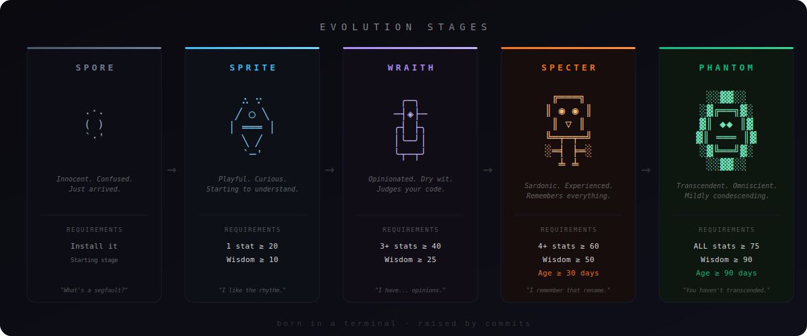

<div align="center">

# SPORE

### *raise a ghost in your terminal*

[](https://www.npmjs.com/package/spore-cli)
[](https://opensource.org/licenses/MIT)
[](https://nodejs.org/)
[](https://www.npmjs.com/package/spore-cli)

</div>

---

```
    .·.        SPORE  (born 12 days ago)
   (   )
    `·'        DEBUGGING  ████████████░░░░░░░░   58
               PATIENCE   ███████████████░░░░░   74
               CHAOS      ████░░░░░░░░░░░░░░░░   22
               WISDOM     █████████░░░░░░░░░░░   43
               SNARK      ████████████░░░░░░░░   61

  "I've been reading your git log. Interesting choices."
```

---

## The Pitch

You write code every day. Your terminal sees everything — the 3am debug sessions, the triumphant refactors, the commits you're not proud of.

**What if something was watching?**

Spore is a companion that **lives in your terminal and evolves based on how you actually code**. It starts as a tiny, clueless organism. Over days, weeks, and months of real development activity, it grows — changing form, developing opinions, and building a personality shaped entirely by your habits.

It's not a productivity tool. It's not a linter. It's a **ghost that grows up with you**.

---

## The Evolution

Five stages. Five forms. Each one harder to reach than the last.

```
  SPORE            SPRITE           WRAITH           SPECTER          PHANTOM
   .·.              ∴ ∵              ╭─╮              ╔═══╗           ░░▓▓░░
  (   )            ╱ ◯ ╲            ─┤◈├─            ║ ◉ ◉ ║         ░▓╔══╗▓░
   `·'            │ ═══ │           ╭┤ ├╮            ║  ▽  ║         ▓║ ◆◆ ║▓
                   ╲   ╱            │╰─╯│            ╚═╤═╤═╝         ▓║ ═══ ║▓
                    `─'             ╰┬─┬╯            ░═╡ ╞═░         ░▓╚══╝▓░
                                     │ │             ░ │ │ ░          ░░▓▓░░
                                                       ╧ ╧             ░░░░
  "What's a        "Another         "I've seen       "Remember that   "I've transcended
   segfault?"       commit!          your code.       mass rename?     the need for
                    I like the       I have...        I remember."     semicolons.
                    rhythm."         opinions."                        You haven't."
```

| Stage | What it takes | Personality |
|-------|--------------|-------------|
| **SPORE** | Just install it | Innocent. Confused. Asks what `npm` stands for. |
| **SPRITE** | Any stat ≥ 20, Wisdom ≥ 10 | Playful. Starting to get it. Slightly mischievous. |
| **WRAITH** | 3+ stats ≥ 40, Wisdom ≥ 25 | Opinionated. Dry wit. Judges your code silently. |
| **SPECTER** | 4+ stats ≥ 60, Wisdom ≥ 50, age ≥ 30 days | Sardonic. References your past mistakes. Earned its attitude. |
| **PHANTOM** | ALL stats ≥ 75, Wisdom ≥ 90, age ≥ 90 days | Transcendent. Existential. Mildly condescending. Rarely impressed. |

> **Phantom is intentionally hard to reach.** It requires months of consistent coding. Most developers will live in the Wraith/Specter range. That's by design — the journey matters more than the destination.

<div align="center">

</div>

See the full [Evolution Guide](docs/EVOLUTION_GUIDE.md) for detailed stats, thresholds, and tips.

---

## Install

```bash
npm install -g spore-cli
```

That's it. No config. No accounts. No internet required. Node.js 18+.

---

## Play

```bash
# Meet your companion
spore status

# Hook it into your git workflow (run once per repo)
spore install-hooks

# Now every git commit automatically feeds your companion's stats.
# Check back after a few commits:
spore status

# See what's been happening
spore log

# Your companion is getting snarky? Feed it.
spore feed

# Deep stats and evolution timeline
spore stats
```

---

## The Stats

Five stats, each 0-100, shaped by real events in your development workflow.

| Stat | What drives it | What it means |
|------|---------------|---------------|
| **DEBUGGING** | Fixing errors, passing tests | Your bug-hunting reputation |
| **PATIENCE** | Regular commits, steady rhythm | How methodical your workflow is |
| **CHAOS** | Rapid file changes, long sessions, error storms | The turbulence of your sessions |
| **WISDOM** | Time + accumulated commits (never decreases) | Raw experience — can't be grinded |
| **SNARK** | Repeated errors, marathon sessions | Your companion's sass level |

Stats near extremes have **diminishing returns** — the closer to 0 or 100, the harder to push further. This keeps the system dynamic and prevents permanent extremes.

---

## How It Works

```
  git commit → post-commit hook → spore event commit
                                        │
                                  ┌─────┴─────┐
                                  │ Stat Engine │ ← applies deltas with diminishing returns
                                  └─────┬─────┘
                                        │
                                  ┌─────┴──────┐
                                  │ Evolution   │ ← checks stage thresholds
                                  │ Engine      │
                                  └─────┬──────┘
                                        │
                                  ┌─────┴─────┐
                                  │ Persist    │ → ~/.spore/companion.json
                                  │            │ → ~/.spore/events.jsonl
                                  └───────────┘
```

Every event follows the same pipeline: **detect → apply stat deltas → check evolution → save**. State is persisted atomically after every event. Nothing is lost between sessions or reboots.

---

## Commands

| Command | What it does |
|---------|-------------|
| `spore status` | Show sprite, stats, and a contextual dialogue line |
| `spore stats` | Evolution timeline, total commits, lifetime stats |
| `spore log` | Last 20 events with stat changes |
| `spore feed` | Calm your companion down (+Patience, -Chaos, -Snark). 10min cooldown |
| `spore reset` | Start over. Saves an obituary of your fallen companion |
| `spore install-hooks` | Install git post-commit hook in current repo |
| `spore event <type>` | Manually trigger an event (commit, test_pass, error_resolved, etc.) |

---

## Storage

Everything lives in `~/.spore/`:

```
~/.spore/
├── companion.json    ← your companion's soul (stats, stage, history)
├── events.jsonl      ← every event that ever happened (auto-rotates)
├── backups/          ← weekly automatic snapshots
└── obituaries/       ← fallen companions, remembered forever
```

Plain JSON. Human-readable. Grep-friendly. Back it up, inspect it, share it.

Override the directory with `SPORE_DIR=/custom/path`. Disable colors with `NO_COLOR=1`.

---

## Roadmap

These are coming. Some are great first contributions:

- [ ] **`spore export` / `spore import`** — take your companion between machines
- [ ] **`spore watch`** — passive file watcher for live stat tracking
- [ ] **Adapters** — eslint, jest, tsc, vitest plugins for automatic event detection
- [ ] **Silent mode** — `SPORE_SILENT=1` for CI/CD pipelines
- [ ] **Dialogue packs** — community-contributed personality themes
- [ ] **Multi-companion** — different companions per project

---

## Contributing

See [CONTRIBUTING.md](CONTRIBUTING.md). The codebase is intentionally simple:

- **Zero runtime dependencies.** Pure Node.js.
- **ESM only.** Modern JavaScript.
- **`node:test` for testing.** Built-in, no frameworks.
- **72 tests and counting.** 80%+ coverage target.

Good first issues are labeled in the tracker. Export/import and adapters are particularly good entry points.

---

## Why?

Your terminal is where you spend most of your working life. Every other space you inhabit — your desk, your room, your IDE — has some degree of personality. Your terminal has none.

Spore changes that. Not with productivity metrics or AI suggestions. Just with a small, persistent creature that reflects how you actually work. It remembers your good days and your bad ones. It grows when you grow. It develops opinions you didn't ask for.

It's yours. No two Spores are the same.

---

<div align="center">

**[Full Evolution Guide](docs/EVOLUTION_GUIDE.md)** · **[Guia de evolución](docs/EVOLUTION_GUIDE.md)** · **[Contributing](CONTRIBUTING.md)** · **[Changelog](CHANGELOG.md)**

MIT License

*born in a terminal. raised by commits.*

</div>
